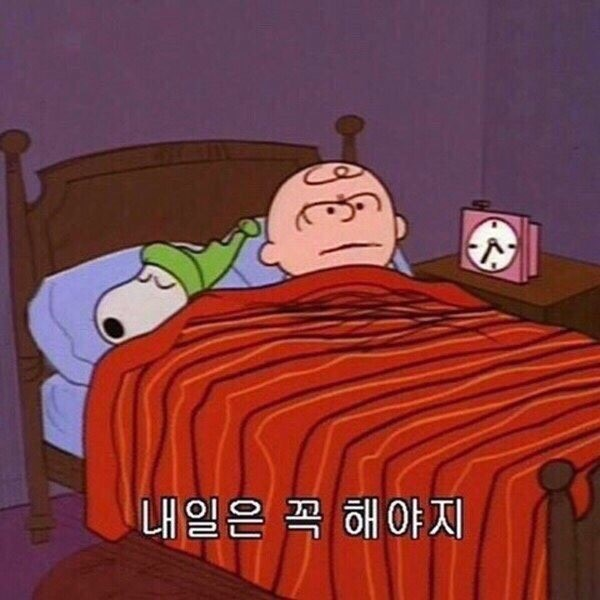
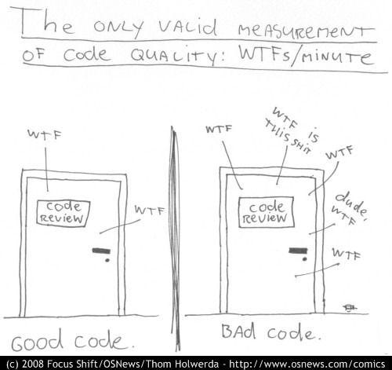

## 깨끗한 코드

### ✅ 개발자란 무엇일까요?

  

프랑스 문인 귀스타브 폴 발레리는 시란 영원히 미완성이라 끝없는 재작업이 필요하며 포기할 때에만 끝난다고 말합니다. 저 또한 개발자는 시인과 같고 코드는 시와 같다고 생각합니다. 클린코드를 추구하는 개발자에게 있어서 코드란 끝도 없이 리팩토링을 할 수 있는 존재이고 개발자가 포기할 때 비로소 리팩토링이 끝난다고 생각합니다.. (😀물론 끝났다고 말은 할 수 없다. 코드에 정답은 없으니!)

### ✅ 클린 코드는 어떻게 공부를 해야할까요?

  

클린 코드를 배우는 것은 자전거를 배우는 것과 같다고 합니다. 훌륭한 강사님을 모셔두고 말로 행동으로는 백 번 보여주고 설명을 해줄 수도 있습니다. 하지만 누구나 설명을 듣고서는 바로 자전거는 똑바로 타지 못합니다. 많이 넘어지고 비로소 자신의 노하우를 터득을 하였을 때 자전거를 잘 탈 수 있습니다.

### ⭐ 르블랑의 법칙

  

80년대에 킬러 앱 이라고하는 프로그램이 있었습니다. 사람들이 해당 프로그램을 많이 사용하였지만 프로그램을 사용 하다보면 갑자기 프로그램이 죽는 등 각종 버그들이 많이 있고 시동 시간도 길어졌습니다. 업데이트를 하더라도 해당 버그들은 그대로 남아있었고. 해당 프로그램을 만든 회사는 이후 금방 망하게 됩니다. 나중에 되어서야 초창기 직원의 말을 들어보면 출시에 바빠 코드를 마구 짰다고 합니다. 기능을 추가할수록 코드는 엉망이 되어갔고 나중에는 감당을 하기 힘들 정도의 수준까지 이르렀다고 합니다. 이러한 상황을 만든데에는 나쁜 코드가 원인이었습니다. 나쁜 코드에 발목이 잡히는 것을 우리는 **고행**이라고 부릅니다. 처음에는 급하게 짰지만 나중에 수정을 하지 않을까..? 나중에 리팩토링을 하지 않을까..? 라고 생각을 합니다. 하지만 저희는 깨닫습니다. **나중은 결코 오지 않는다는 것을 말이죠.**

### ⭐ 한분야의 전문가가 되기 위해서는 나쁜 코드를 사용하지 말아야합니다.

프로젝트의 관리자는 일정을 잡으면서 우리에게 이 시간내에 맞춰달라고 이야기를 합니다. 여기서 우리는 시간, 마감 기한을 맞추기 위해서 코드를 짜다보면 나쁜 코드가 만들어집니다. 대다수의 관리자들은 일정과 요구사항에 맞춰서 개발자들을 강력하게 밀어세웁니다. 그것이 그들의 책임이기 때문이죠 하지만 개발자들도 좋은 코드를 사수하는 것이 그들의 책임이기에 좋은 코드를 사수해야합니다. 이 책에서는 이 책임의 비유를 의사로 들었습니다.

  

> 어느 환자가 수술 전에 손을 씻지 말라고 요구합니다. 시간이 너무 오래걸리니까. 의사에게 있어서 환자는 사앗입니다. 하지만 의사는 단호하게 거부합니다. 질병과 감염의 위험을 환자보다 의사가 더 잘 아니까 말이죠. 환자의 말을 그대로 따르는 행동은 (범죄일 뿐만 아니라) 전문가 답지 못합니다. -7p

프로그래머도 마찬가지 입니다. 나쁜 코드의 위험을 이해하지 못하는 관리자의 말을 그대로 따르는 행동은 전문가 답지 못합니다.

### ✅ 나쁜 코드가 무엇일까요?

  

위 사진에서 나쁜 코드는 욕이 많이 나오는 코드를 뜻합니다. 또 이책에서의 나쁜 코드는 다음과 같이 설명하고 있습니다.

1. 나쁜 코드는 나쁜 코드를 유혹한다. 나쁜 코드를 고칠려고하면 오히려 더 나쁜 코드를 만든다. - (비야네 스트롭스트룹)
2. 깨진 창문과 같다. 창문이 깨지면 사람들은 관심을 가지지 않는다. 창문이 더 깨지고 외벽에 낙서가 생기고 쓰레기가 생겨도 방치를 한다. - (데이브 토마스, 앤디 헌트)

나쁜 코드를 남겨두면 나쁜 코드의 영향력으로 또 나쁜 코드가 나올 수 있습니다. 이렇기에 나쁜 코드를

### ✅ 깨끗한 코드는 무엇일까요?

이 책에서는 여러 개발자들이 본인의 주관에 맞게 얘기를 해줍니다.

1. 우아하고 효율적인 코드이다. - (비야네 스트롭스트룹)
2. 잘 쓴 문장처럼 읽히는 가독성이 좋아야 한다. - (그래디 부치)
3. 다른 개발자가 보더라도 읽기 쉽고 고치기 쉽다. 테스트 케이스도 존재한다. - (데이비 토마스)
4. 누군가 주의 깊게 짰다는 느낌을 준다. 고치려고 살펴보아도 이미 모든 사황을 고려해서 짰으므로 고칠 궁리를 하다보면 제자리로 돌아온다. 그리고 그 코드에 감사함을 느낀다. - (마이클 페더스)
5. 중복이 없고, 한 가지 기능만 수행한다. 이름만 봐도 기능을 알 수 있고 작게 추상화 한다. - (론 제프리스)
6. 코드를 읽으면서 짐작했던 기능을 각 루틴이 그대로 수행한다면 깨끗한 코드이다. 또 코드가 그 문제를 풀기위한 언어처럼 보인다면 아름다운 코드이다. - (워드 커닝햄)

### ⭐ 코드를 깨끗하게 만드는 방법 보이스카우트 규칙

  

시간이 지날수록 엉망으로 전략하는 코드가 한 둘이 아닙니다. 그로므로 우리는 적극적으로 코드의 퇴보를 막아야 한다고 합니다. 미국 보이스카우트의 규칙이 개발자들에게도 아주 유용합니다.

> 캠프장은 처음 왔을 때보다 더 깨끗하게 해놓고 떠나라. - 로버트 스테펜슨 스미스 바덴-파웰

시간이 지날수록 코드가 깨끗해진다면 절대 나빠지지 않는 코드를 만들 수 있습니다. 또 시간이 지날수록 코드가 좋아지는 프로젝트에서 작업을 한다고하면 생각만해도 좋을 것 같습니다.😀

#### 끝으로

1장을 읽고 깨끗한 코드와 나쁜 코드의 영향력을 알아 이 코드들이 팀과 프로젝트의 어떤 영향력을 행사하는지 알았습니다. 깨끗한 코드를 이야기할 때 마이클 페더스님의 감사함을 느끼는 코드라는 말이 인상이 깊었습니다. 저도 누군가에게 감사함을 주는 그런 코드를 만들어보고 싶습니다.
